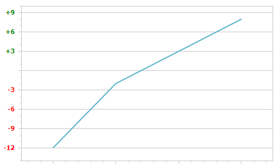

<!-- default badges list -->

<!-- default badges end -->
# Chart for WinForms - How to Individually Customize Axis Labels

Apart from the capability to customize the overall appearance of [axis labels](https://docs.devexpress.com/WindowsForms/5804/controls-and-libraries/chart-control/axes/axis-labels), you can obtain individual axis labels at runtime. Then, it's possible to apply all the options available for axis labels to them, individually. You can apply different formatting to axis labels based on some criteria (for example, an axis value threshold).

For this, handle the [CustomDrawAxisLabel](https://docs.devexpress.com/WindowsForms/DevExpress.XtraCharts.ChartControl.CustomDrawAxisLabel) event to obtain axis labels.

The following image shows the resulting Chart:

<!-- default file list -->
## Files to Review

* [Form1.cs](./CS/CustomAxisLabels/Form1.cs) (VB: [Form1.vb](./VB/CustomAxisLabels/Form1.vb))
<!-- default file list end -->

## Documentation

* [Chart Control - Axis Labels](https://docs.devexpress.com/WindowsForms/5804/controls-and-libraries/chart-control/axes/axis-labels)
* [ChartControl.CustomDrawAxisLabel](https://docs.devexpress.com/WindowsForms/DevExpress.XtraCharts.ChartControl.CustomDrawAxisLabel)
<!-- feedback -->
## Does this example address your development requirements/objectives?

 

(you will be redirected to DevExpress.com to submit your response)
<!-- feedback end -->
